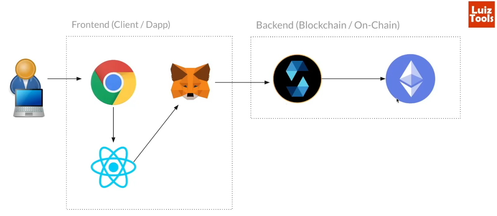

# Blockchain Experiments

## BBB Voting System

## Architecture

## Terms

* Nonce: Number User Once or Golden Number
* Proof of Work(PoW): It is the process of generating the Hash until it meets the Blockchain rule (e.g. starting with four 0)
* Proof of Participation(PoP): Is the name of an algorithm that requires users to hold an amount of cryptocurrency on the network to become validators
* Hash Rate para mineração: medida em MH/s (milhões de SHA-256 hashes por segundo)
* EVM = Ethereum Virtal Machine
* Mainnet = Production Network
* BNB = Binance Crypt (TBNB = Test Binance Crypt)

## Operations Smart contract at Blockchain
1. Call
2. Transaction (with tax)
3. Smart Contract (Call or Transaction)

## Test Blockchain Websites
* [Binance Test Blockchain Sites](https://testnet.bscscan.com/)
    * [Obtain BSC Testnet tokens](www.bnbchain.org/en/testnet-faucet)

## Steps to Deploy
1. Create account at MetaMask website
2. Obtain credit from MetaMask at [Obtain BSC Testnet tokens](www.bnbchain.org/en/testnet-faucet)
3. Deploy project from remix in MetaMask
    1. In Remix/Environment, Select "Inject Provider - MetaMask" and click in "Deploy"
 
## Challenges:
- [X] More participants
- [X] More information about the participant - Structure separately - with photo
- [ ] Possibility of changing ownership
- [ ] Allow repeated votes with timelock (time between each vote)

## References
* [Website for tests](https://remix.ethereum.org)

